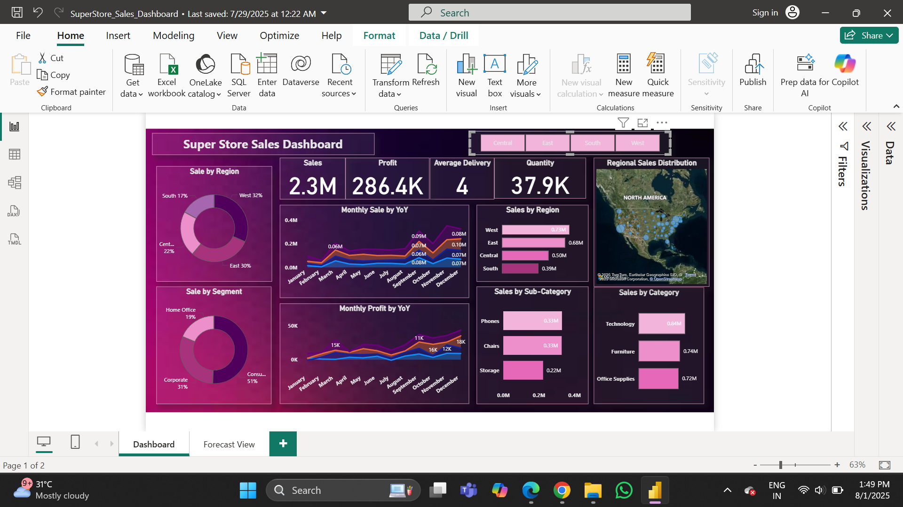
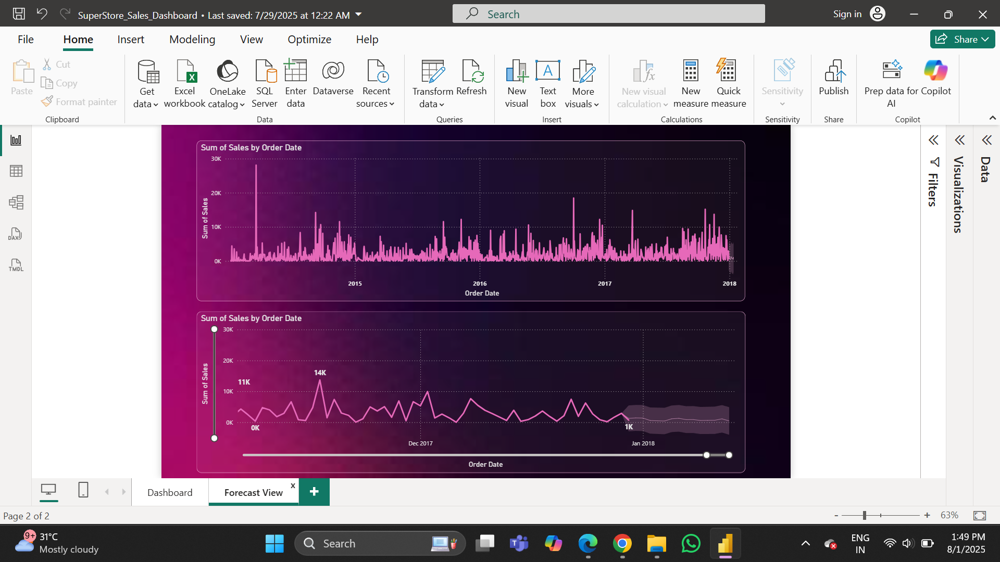

# 📊 Superstore Sales Forecasting Dashboard (Power BI)

A professional interactive dashboard built using Power BI to analyze sales, profit, regional distribution, and time-based performance metrics of Superstore data.

## 📌 Key Features
- Total Sales, Profit, Quantity, Avg Delivery KPIs
- Monthly Sales & Profit Year-on-Year trend analysis
- Sales distribution by Segment, Region, Category, and Sub-Category
- Geo-mapped Regional Sales
- Clean, themed visuals and interactive slicers
- Forecast View (second tab for future planning)

## 🛠 Tools Used
- Power BI Desktop
- DAX Measures
- Power BI Maps
- Data Visualizations and Drilldowns

## 📷 Dashboard Preview

---

## 📁 Files
- `Superstore_Sales_Dashboard.pbix` – main dashboard
- `data/Superstore_Data.xlsx` – sample dataset
- `assets/` – screenshots

---

## 📬 Contact
Made with ❤️ by Aarzoo Maurya  
📧 Email: [response2aarzoo@gmail.com]  
🔗 [www.linkedin.com/in/aarz00]

